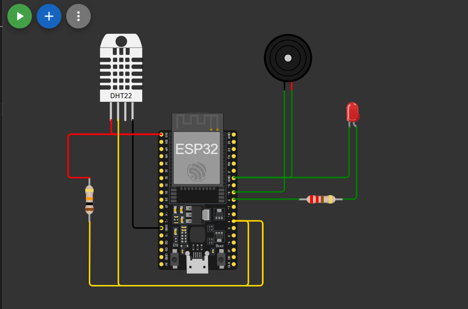

# 🔥 ESP32 Heater Control System

A simple simulation project that uses an **ESP32**, a **DHT22 temperature sensor**, and a **relay-controlled heater** (represented by an LED) to demonstrate heater control logic. This project is built and tested entirely in the **Wokwi simulator**.

---

## 🧠 Features

- Reads temperature and humidity using the **DHT22** sensor
- Turns a **simulated heater (LED)** ON/OFF based on a set temperature threshold
- Displays current sensor readings and system state over the **serial monitor**
- Fully simulated – no hardware required

---

## 🖼️ Circuit Diagram

> ⚠️ **Note:** The **LED** in the diagram and simulation represents the **heater**.

---

## ▶️ Wokwi Simulation Link

👉 [Click here to open the simulation in Wokwi]((https://wokwi.com/projects/438153436114816001))

> Replace the link above with your actual Wokwi simulation URL.

---

## 📚 Libraries Used

- **DHT sensor library** for interfacing with the DHT22  
  📄 See: [`wokwi-lib-list.txt`](./wokwi-lib-list.txt)

---

## 💡 Heater Representation in Simulation

Since **Wokwi** does not provide a dedicated heater component, an **LED** is used as a visual indicator:

- **LED ON** → Heater is ON
- **LED OFF** → Heater is OFF

This allows easy understanding of the heater logic without real-world hardware.

---

## 📂 Project Files

| File                     | Description                                   |
|--------------------------|-----------------------------------------------|
| `sketch.ino`             | Main Arduino code for the ESP32               |
| `heater_contol_circuit.png` | Circuit diagram showing component connections |
| `wokwi-lib-list.txt`     | Auto-generated Wokwi library list             |
| `README.md`              | Project overview and documentation            |
| `LICENSE`                | Project license (MIT or other, as applicable) |

---

## 🛠️ How to Use

1. Open the Wokwi simulation using the link above.
2. Click the green "Start Simulation" button.
3. View temperature readings and heater status via the serial monitor.
4. Change the temperature threshold in code (`sketch.ino`) as needed.

---

## 👤 Author

**Ranveer Singh Shekhawat**  
Made for learning and simulation purposes using ESP32 and Wokwi.

